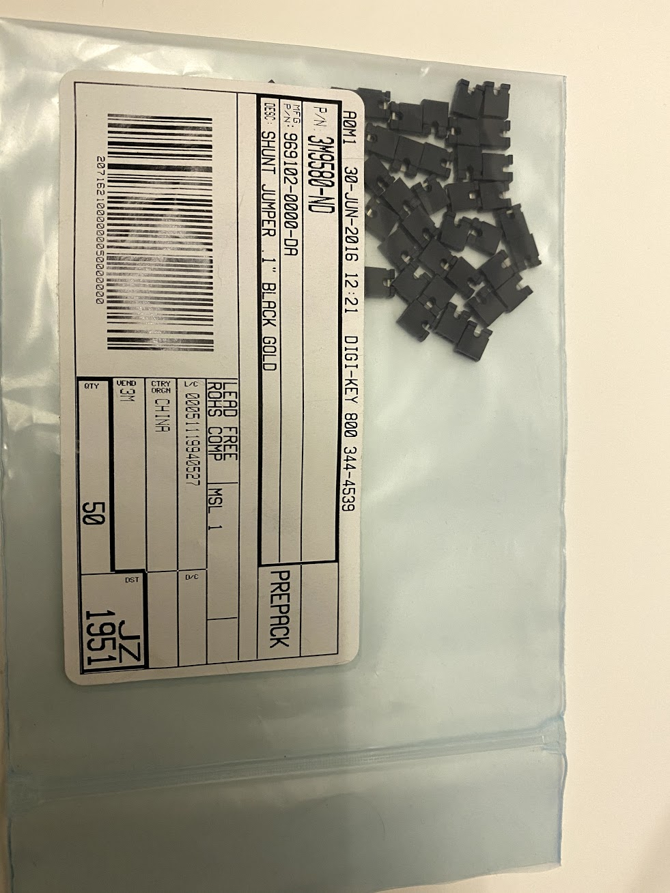
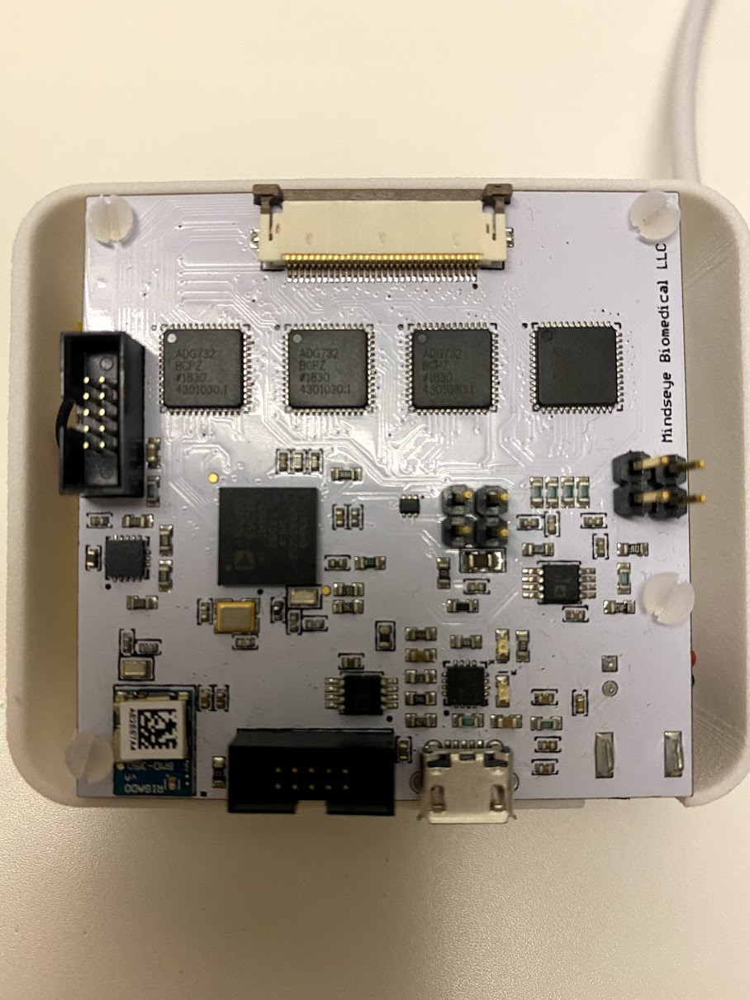
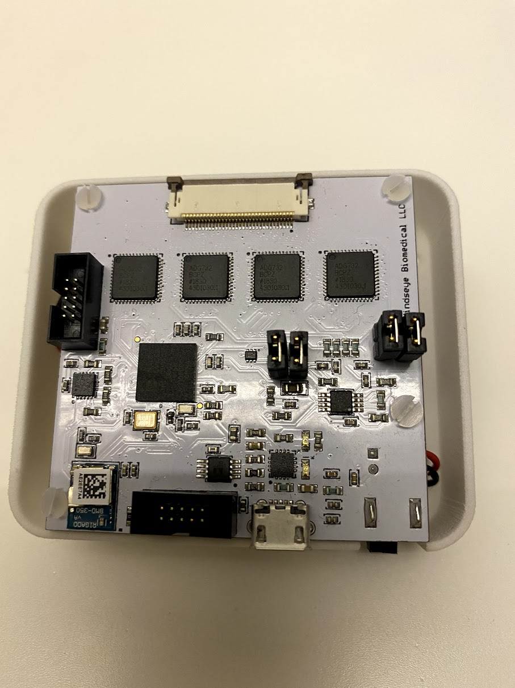

FAQ
========

Question 1:
^^^^^^^^^^^^^^
**How do I insert and remove the flex PCB cable?** 

.. raw:: html

    <iframe width="560" height="315" src="https://www.youtube.com/embed/Xu2VkoUc4vU" frameborder="0" allow="accelerometer; autoplay; encrypted-media; gyroscope; picture-in-picture" allowfullscreen></iframe>

Question 2: 
^^^^^^^^^^^^^^    
**I wish to run it with a battery - how do I do that?**

The following battery will fit perfectly within the case, and should be connected to the white connecter. `Link to battery here <https://www.mouser.com/ProductDetail/SparkFun/PRT-13854?qs=%2Fha2pyFaduhhffVdrtA13QFmgMgxqz4D6Ok5h%2FDT9uAKN5KRgjnjIA%3D%3D>`_ 

Question 3: 
^^^^^^^^^^^^^^  

**I appreciate the IEC60601-1 compliance for biomedical applications, as it ensures safe use a small currents. However, I have a non-biological application where I'd like to remove the DC filters, how can I do it? **

The IEC filters can be bypassed by adding jumpers. Below I show three pictures, one of example 2.54mm suitable jumpers from Digikey, a second picture of the board without jumpers, and a third picture of the board with jumpers correctly in place. Now, Spectra is operating without the IEC compliant filters enabling you to change the current, and also get the most accurate phase measurement(the capacitor in the IEC filter slightly alters the phase). Do remember you accept all risk for using your Spectra. 

  

Question 4: 
^^^^^^^^^^^^^^  
**Where is the code kept and how can I contribute to it?**

Below is a link to the repositories. If you'd like to collaborate on this project, have a look at the issues existing in each of the repositories and create a pull request to solve one, or create an issue of your own. 

`Code <https://github.com/openeit>`_ 
