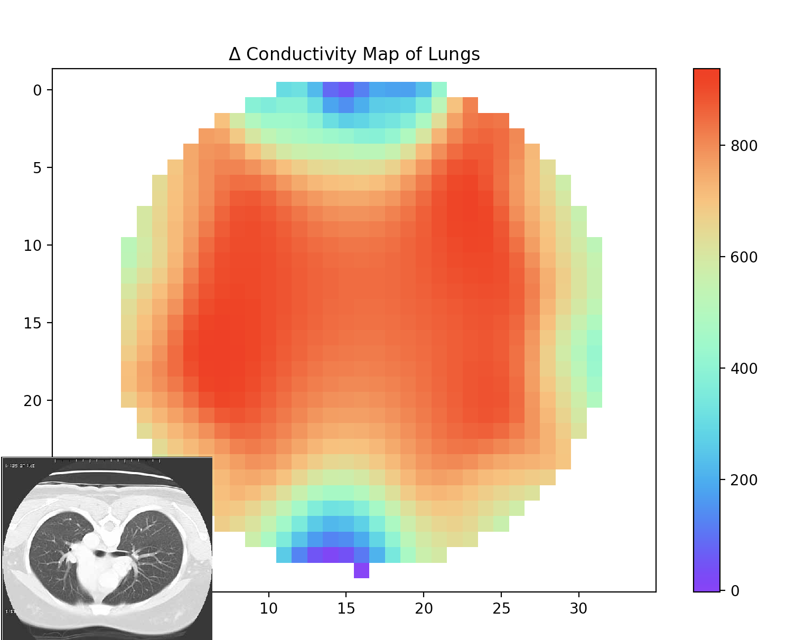

Documentation and Tutorials for OpenEIT
========================================

Crowdfunding Campaign for the Spectra EIT kit
^^^^^^^^^^^^^^^^^^^^^^^^^^^^^^^^^^^^^^^^^^^^^^

Support this effort by getting your own kit! 

`<https://www.crowdsupply.com/mindseye-biomedical/spectra>`_

Project Description 
^^^^^^^^^^^^^^^^^^^^

`<https://hackaday.io/project/159737-spectra-open-biomedical-imaging>`_

Install the Software 
^^^^^^^^^^^^^^^^^^^^^^

`download the OpenEIT Installer for OSX <https://drive.google.com/file/d/1HyXHlD_yWJ59-XPO1OVrtmmT3S0sozim/view?usp=sharing>`_

Or click on the left menu where it says 'installation' to get detailed instructions applicable to OSX, Windows and Linux. 

Join the Community Technical Discussion List
^^^^^^^^^^^^^^^^^^^^^^^^^^^^^^^^^^^^^^^^^^^^^

Ask questions, or talk with others about ideas you might want to try. 

`Mailing List <https://groups.google.com/group/OpenBiomedicalImaging/boxsubscribe>`_

Guide
^^^^^

.. toctree::
   :maxdepth: 4
   :caption: Contents:

   introduction
   installation
   license
   help

Indices and tables
==================

* :ref:`genindex`
* :ref:`modindex`
* :ref:`search`
