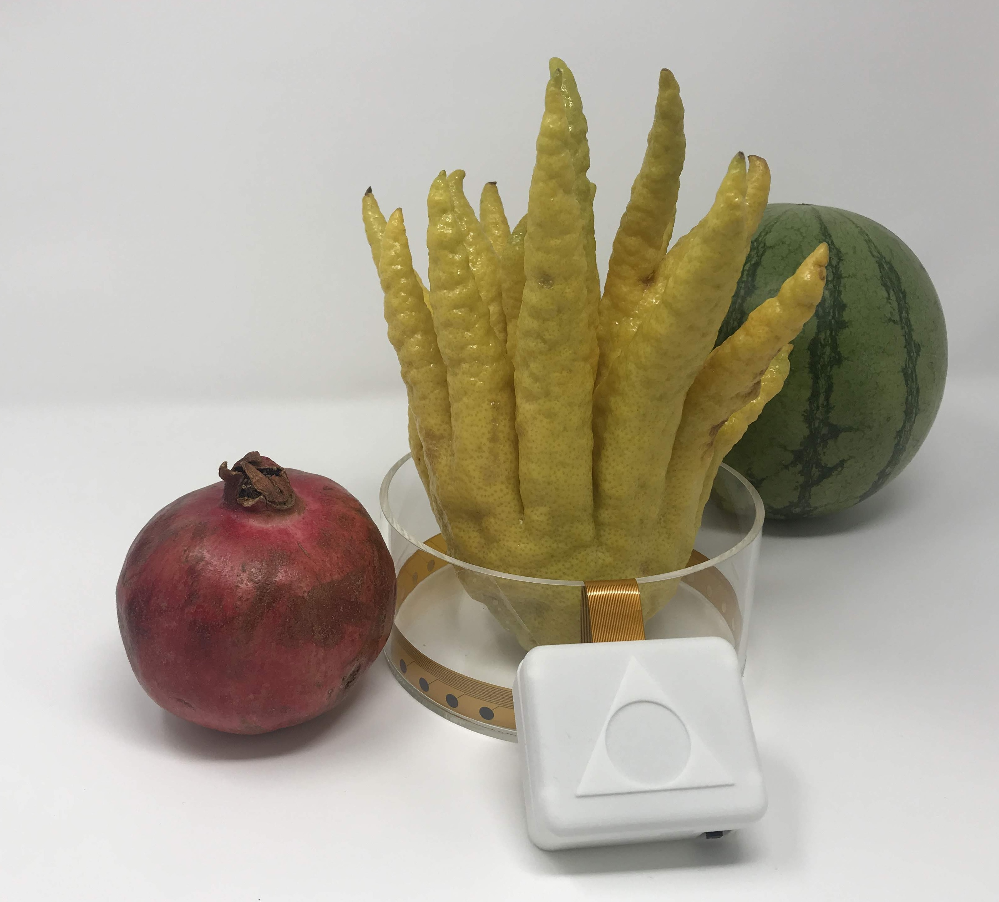
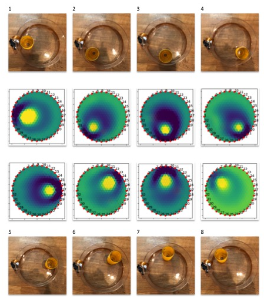

Installation
=============

Below are both text/picture based installation directions and a video which takes the user from receiving and unpackaging a Spectra EIT and Bioimpedance device through to EIT image reconstructions. 

.. raw:: html

    <iframe width="560" height="315" src="https://www.youtube.com/embed/Ssm7BgsbbWI" frameborder="0" allow="accelerometer; autoplay; encrypted-media; gyroscope; picture-in-picture" allowfullscreen></iframe>

Step 1: Install the Software
^^^^^^^^^^^^^^^^^^^^^^^^^^^^^
If you have OSX you can run a simple installer by downloading the following DMG then double click to install it as an application. 

`download the OpenEIT Installer for OSX <https://github.com/OpenEIT/OpenEIT/releases/download/v1.0/OpenEIT-1.0.0.dmg>`_

If you are not running OSX or wish to tinker with the code, you will need to install the python modules by following the directions in the readme here: 
`<https://github.com/OpenEIT/OpenEIT>`_

Congratulations! You should see the software running and it will look like this:

.. image:: ./images/software.png
  :width: 500
  :alt: Dashboard Screenshot

Step 2: Device Set Up
^^^^^^^^^^^^^^^^^^^^^^

Press the 'ON' button on your EIT device. Make sure that you've charged the battery first. You can also put some water in tank, just enough so that the electrodes are under water. 

Step 3: Gather Data and Experiment
^^^^^^^^^^^^^^^^^^^^^^^^^^^^^^^^^^^^
You should see the bluetooth device appear in the dropdown menu in the software and hit connect. If there is any problem, restart both the device and the software to refresh. 

Once you are connected you can do electical impedance image reconstructions. Just go to the reconstruction tab and then move an object around the tank. You should see the outline of the image being reconstructed. You can try different numbers of electrodes, baselining the image to change the scale, time series data for looking at impedance based changes in cells, spectroscopy to see dielectric spectrums and more. 

Congratulations! 
^^^^^^^^^^^^^^^^

You have done your first biomedical imaging experiment! This is the same method used in multi-million dollar CATSCANS, except without any harmful radiation, and can be used to see difference over time of any conductive body. Let's try some more tutorials next to get more ideas of what you can do with it. 

As you go further you are welcome to edit the code, and improve upon what is already here. You can find issues listed in the github respository, or submit pull requests with your updates. We love hearing feedback about interesting experiments and applications people are investigating, so please feel free to email: contact@mindseyebiomedical.com