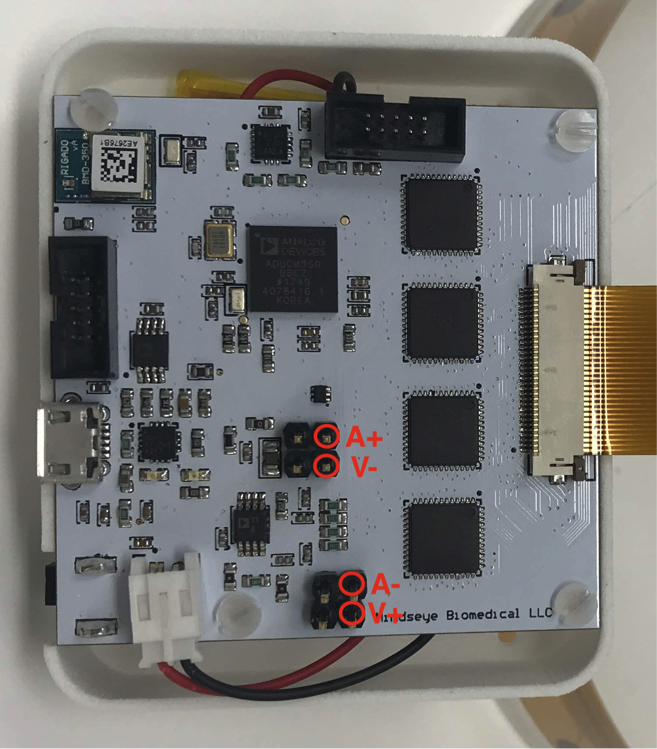
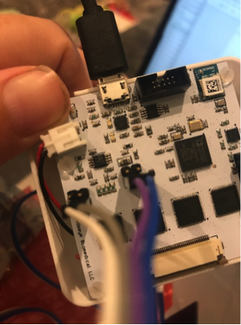
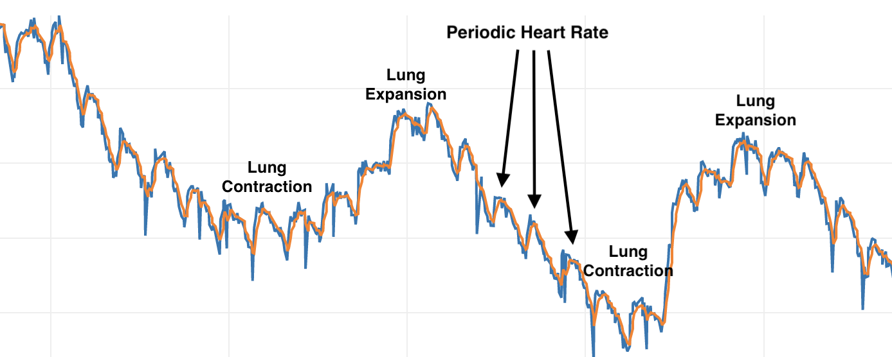

Tutorial 1 - Time Series
==========================

Introduction: 
^^^^^^^^^^^^^^^^^^^^^^^^^^^^^

Time series measurements can be used to measure a change at a single frequency at a faster time resolution. This can let you see things like the volume of air you intake into your lungs, the amount of blood pumping through your heart valves(impedance cardiography) and other physical changes such as stomach or bladder fullness and more! Think of any change in your body you'd like to monitor, or even in a cellular assay and give it a go! 

Here is me breathing. You can see the volume of air I take into my lungs! 

.. raw:: html

    <iframe width="560" height="315" src="https://www.youtube.com/embed/wD7cW758K70" frameborder="0" allow="accelerometer; autoplay; encrypted-media; gyroscope; picture-in-picture" allowfullscreen></iframe>

Step 1: Device Set Up
^^^^^^^^^^^^^^^^^^^^^^^^^^^^^

For time series measurement we skip the multiplexer section of the board and just run from the headers. Below is a diagram showing where to plug you 0.1" cable into. 

Once you are plugged in, make sure you have some electrodes on the other end of your cable. I recommend gold plated electrodes, and in general everything usually works better with electrode gel. If you want a dry connection you should try it(often this is great for large signals) but if you want to measure something more subtle give an conductive gel connection a go to make sure you are getting the most information you can out of the device. 

.. image:: ./images/time_series_aftersetup.png
  :width: 200
  :alt: Time Series After Set Up

Step 2: Body Attachment
^^^^^^^^^^^^^^^^^^^^^^^^^^
This is going to depend on what area you are interested in measuring, but the theory is the same as it is for impedance cardiography(mechanical heart valve measurement). The current should pass through the object of interest so the send electrodes(A+,A- should be on one side, and the sense electrode V+,V- on the other)

Step 3: Gather Data and Experiment!
^^^^^^^^^^^^^^^^^^^^^^^^^^^^^^^^^^^^

Press the 'ON' button on your EIT device. Make sure that you've charged the battery first. Start the software that you installed by following the installation section of this document. You should see the bluetooth device appear in the dropdown menu in the software and hit connect. If there is any problem, restart both the device and the software to refresh. 

Now the important part - on the Control screen type 'A' in the box to send data and hit send, this will switch it into time series data collection mode. Now simply click on the time series tab of the software, and you should see your data. 

You will see the raw signal, a filtered signal and an FFT of your data. If you are having any troubles getting a good signal try experimenting with electrode position.

A little not on what you are seeing. It's quite different though correlated with the ECG signal. ICG is actually measuring the mechanical movement of blood through your heart valves(indeed it can do this on any other part of the body).

Congratulations! You can now do this to any part of the body you are interested in measuring a change in. 

