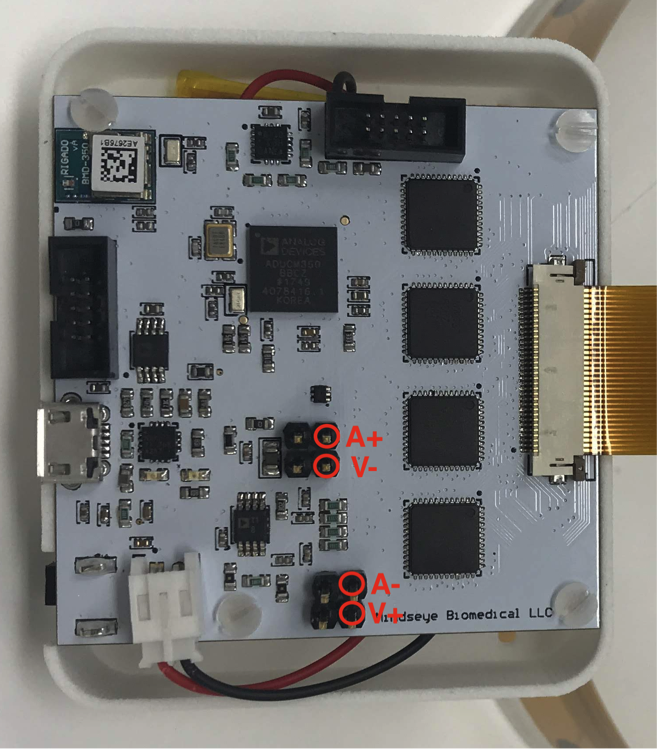
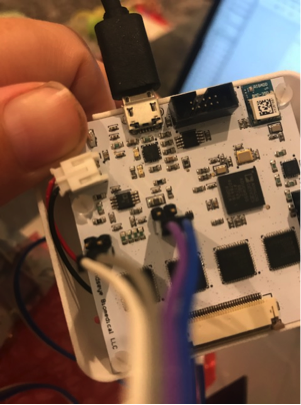
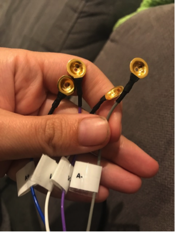
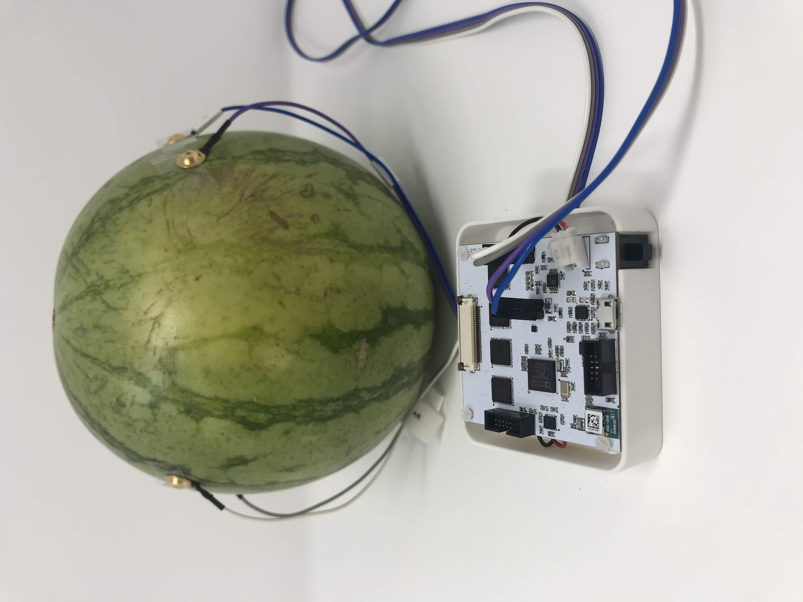
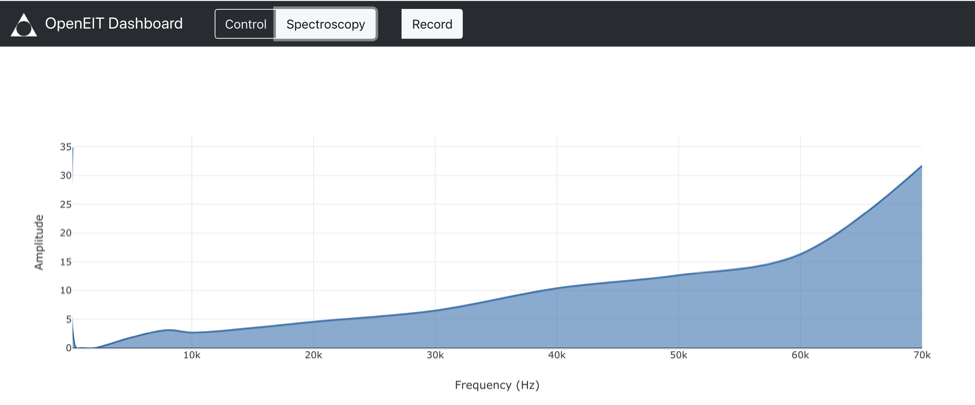
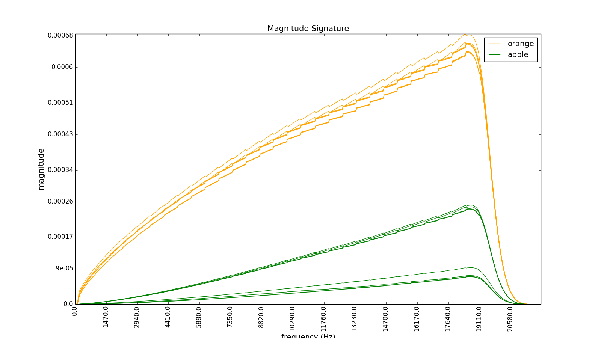
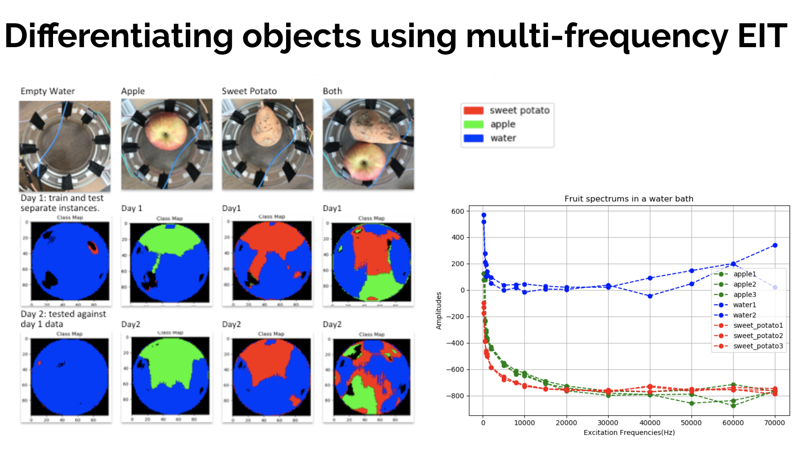

Tutorial 2 - Bioimpedance Spectroscopy
===========================================

Introduction: 
^^^^^^^^^^^^^^^^^^^^^^^^^^^^^

Bioimpedance Spectroscopy is similar to the time series measurement in how it is setup, but instead of measuring at a single frequency we ramp between 80Hz and 80Khz to get different frequency responses for different materials. This is useful if you want to distinguish between types of material between the electrodes. 

Step 1: Device Set Up
^^^^^^^^^^^^^^^^^^^^^^^^^^^^^

For bioimpedance spectroscopy measurement we skip the multiplexer section of the board and just run from the headers. Below is a diagram showing where to plug you 0.1" cable into. 

Once you are plugged in, make sure you have some electrodes on the other end of your cable. I recommend gold plated electrodes, and in general everything usually works better with electrode gel. If you want a dry connection you should try it(often this is great for large signals) but if you want to measure something more subtle give an conductive gel connection a go to make sure you are getting the most information you can out of the device. 

Step 2: Attachment
^^^^^^^^^^^^^^^^^^^^^^^^^^
This is going to depend on what area you are interested in measuring, but the theory that the current should pass through the object of interest so the send electrodes(A+,A- should be on one side, and the sense electrode V+,V- on the other). Try putting the send electrodes at a greater distance appart than the sense one which are ideally located near the part you are interested in measuring. 

Step 3: Gather Data and Experiment!
^^^^^^^^^^^^^^^^^^^^^^^^^^^^^^^^^^^^

Press the 'ON' button on your EIT device. Make sure that you've charged the battery first. Start the software that you installed by following the installation section of this document. You should see the bluetooth device appear in the dropdown menu in the software and hit connect. If there is any problem, restart both the device and the software to refresh. 

Now the important part - on the Control screen type 'B' in the box to send data and hit send, this will switch it into bioimpedance data collection mode. Now simply click on the bioimpedance tab of the software, and you should see your data. 

You will see the spectrum and can easily record it by hitting the record button. 

The example above is using fruit. You can see each fruit has a slightly different dielectric spectrum, but you could just as easily replace fruit with your arm or other part of your body. Below shows a simple classification algorithm being run based on obtain spectrums and doing EIT at the same time. It's interesting as you can see where particular materials are located in the water bath. 

Congratulations! You can now do this on any conductive material you want to see the spectrum of. 

