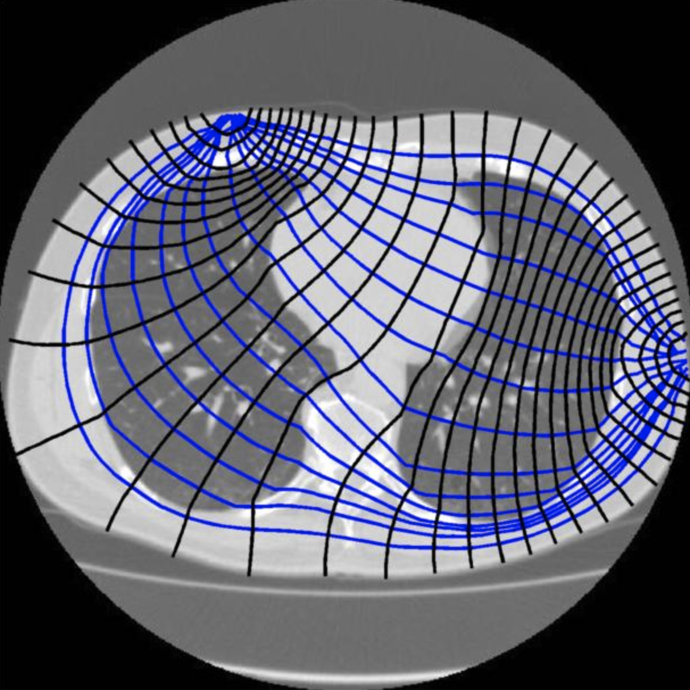
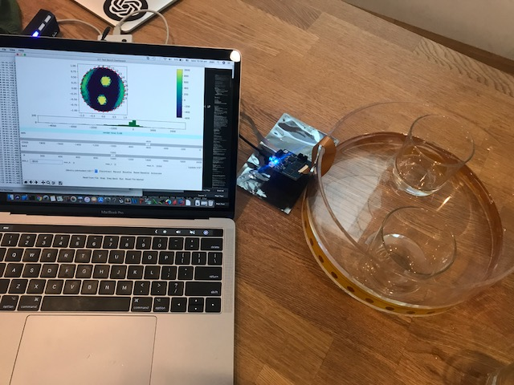
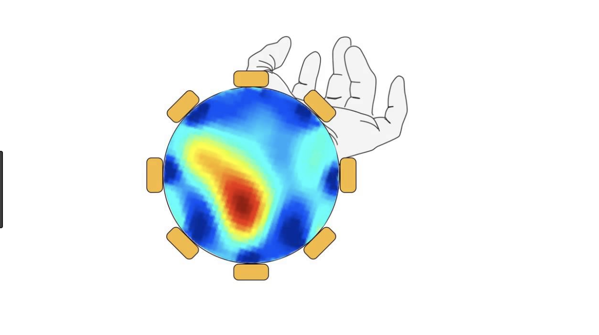

Tutorial 3 - EIT Algorithms
=============================

Introduction: 
^^^^^^^^^^^^^^^^

Electrical Impedance Tomography results can be highly varied and depends on a few basic things like the number of electrodes you are using, the order of measurements(adjacent versus opposition method), how you baseline the data, and of course which algorithm you use. 

Step 1: Algorithm Overview
^^^^^^^^^^^^^^^^^^^^^^^^^^^^^

There are three algorithms in this project - Graz Consensus, Gauss-Newton or the Jacobian method, and Back Projection. Each has it's own pros and cons and can be tuned.
The Spectra kit is using a python port of EIDORS called pyEIT. This means that you can used most of EIDORS functionality in python. 

For more detail on pyEIT start with the readme here - `<https://github.com/OpenEIT/pyEIT>`_ 

For more detail on EIDORS and tutorials see - `<http://eidors3d.sourceforge.net/tutorial/tutorial.shtml>`_   

A couple of things this project would really benefit from if you felt like contributing are: 
1. a data file exchange format to import data from Spectra into EIDORS directly(should be doable but maintainer does not own Matlab currently to do this). 
2. A D-Bar algorithm implementation in python, potentially added to pyEIT. Here is a link to the matlab code and documentation for it - `<https://blog.fips.fi/tomography/eit/the-d-bar-method-for-electrical-impedance-tomography-simulated-data/ >`_   

.. image:: ./images/software.png
  :width: 400
  :alt: Software View

.. image:: ./images/picturegrid.png
  :width: 400
  :alt: 32 electrode EIT  

.. image:: ./images/LungscomparedtoCTScan.png
  :width: 400
  :alt: 32 electrode EIT  

